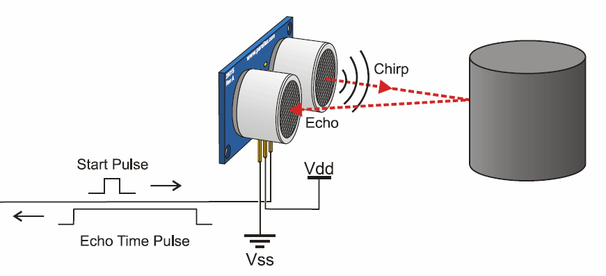
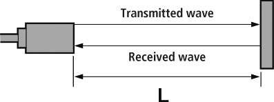

1. [Ultrasonic Range Detector Using Arduino and SR-04F](https://create.arduino.cc/projecthub/rztronics/ultrasonic-range-detector-using-arduino-and-sr-04f-8a804d)
2. https://mechatrofice.com/arduino/ultrasonic/water-level-indicator
3. https://mechatrofice.com/arduino/ultrasonic/water-level-indicator

### Assigment 1

Task 1

ABOUT THIS PROJECT
Want to make a tool that measures distance without using ruler, then this mini project will be the best solution for it. Here we are gonna make a Arduino distance measuring device with a ultrasonic module similar to a bat. So lets get started!

How Does a Ultrasonic Module Work?



This module consists of two drums, one of which is a emitter that emits ultrasound and other is receiver which receives the reflected ultrasound from the object. The emitter drum emits ultrasound when we trigger the module using the trigPin by sending a 10 microseconds high pulse.

As soon as the ultrasound is emitted through the emitter the module makes the echoPin high. Emitted ultrasound travels forward till it gets reflected by object and then travels backward. The reflected ultrasound is detected by the receiver.

When the reflected ultrasound is received by the receiver, echoPin is made low. Now we have the time take by the ultrasound to reach the object and again reach the source which is also equal to the duration for which the echoPin was high. This time is stored in the microcontroller. Therefore travel time of ultrasound between just source to object is half the time take to travel source-object-source we know that:

Distance=Speed x Total Time
But time take to travel distance is half of total time:



2xDistance
2xDistance
Distance=(Time/2) x Speed
Distance=(Time/2) x 29.1       
Where 29.1 is the speed of ultrasound in centimeter/microseconds.

```ino
#define trigPin 13
#define echoPin 12
void setup() 
{
  Serial.begin (9600);
  pinMode(trigPin, OUTPUT);
  pinMode(echoPin, INPUT);
}
void loop() 
{
  long duration, distance;
  digitalWrite(trigPin, LOW);        
  delayMicroseconds(2);              
  digitalWrite(trigPin, HIGH);
  delayMicroseconds(10);           
  digitalWrite(trigPin, LOW);
  duration = pulseIn(echoPin, HIGH);
  distance = (duration/2) / 29.1;
  if (distance >= 200 || distance <= 0)
  {
    Serial.println("Out of range");
  }
  else 
  {
    Serial.print(distance);
    Serial.println(" cm");
  }
  delay(500);
}
```

Task 2

1. explain the code
   1. what do you mean by the keywords?
      1. #define 
      2. void
      3. void setup()
      4. void loop()
      5. digitalWrite()
      6. delay(500);
      7. delayMicroseconds(2); 
    1. how can you declear variable?
    2. 
